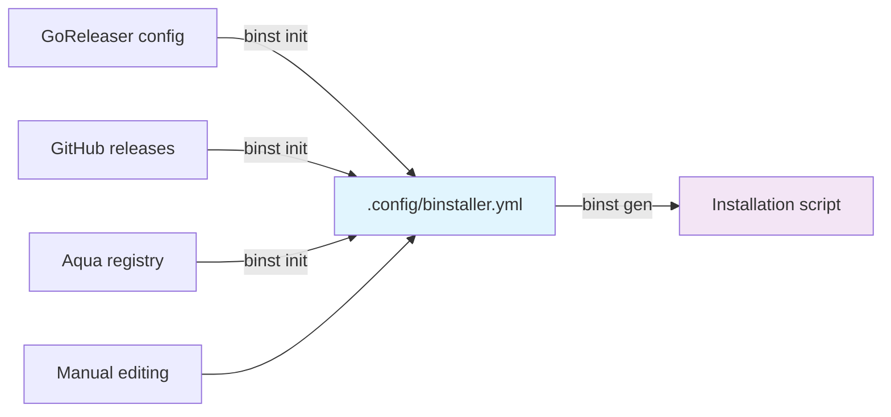

# binstaller

<p align="center">
  
</p>

<p align="center">
  <p align="center">Config-driven secure shell-script installer generator</p>
  <p align="center">
    <a href="/LICENSE.md"></a>
    <a href="https://github.com/binary-install/binstaller/releases"></a>
    <a href="https://scorecard.dev/viewer/?uri=github.com/binary-install/binstaller"></a>
  </p>
</p>

---

**binstaller** (binst) is a config-driven secure shell-script installer generator that creates reproducible installation scripts for static binaries distributed via GitHub releases. Works with Go binaries, Rust binaries, and any other static binaries - as long as they're released on GitHub, binstaller can generate installation scripts for them.

## 🔄 How it Works

binstaller follows a simple two-step workflow:



1. **Step 1:** `binst init` - Generate a `.config/binstaller.yml` config from various sources
2. **Step 2 (Optional):** `binst embed-checksums` - Embed checksums into the config for enhanced security
3. **Step 3:** `binst gen` - Generate the final installation script

## ✨ Key Features

### 📝 Configuration-Based Installer Generation
- Generate installer scripts from a **simple YAML config** (`.config/binstaller.yml`)
- Auto-generate configs from **GoReleaser**, **Aqua Registry**, or **GitHub Releases**
- Hand-edit configs to customize installation behavior
- **Sustainable design** - Uses an intermediate config format that can be maintained independently

  > **Why this matters:** [GoDownloader](https://github.com/goreleaser/godownloader) directly generated scripts from GoReleaser configs. As GoReleaser evolved and added new features, maintaining compatibility became increasingly difficult, ultimately leading to the project being archived. By using an intermediate config format, binstaller can adapt to changes in source formats without breaking existing functionality.

### 🔁 Security Through Reproducible Generation
- Same config always generates the **exact same installer script**
- No random elements or timestamps - fully deterministic output
- Enables **cryptographic signing and verification** (e.g., GitHub Attestation, Cosign)
- Tamper-resistant with cryptographic verification - any modification to installer script is detectable

### 🛡️ Chain of Trust with Embedded Checksums
- Embed binary checksums directly into installer scripts
- When you trust the installer script, you automatically trust the binary
- No need for separate checksum files that could be tampered with
- Complete verification chain: **attestation → installer → binary**

## 📦 Installation

🎉 **You can install binstaller using a binstaller-generated script!**

### Release Installer

Official installers generated by [actionutils/trusted-go-releaser](https://github.com/actionutils/trusted-go-releaser) release workflow, which uses binstaller itself to create these secure installers. These installers provide a chain of trust:

- Generated with `binst gen --target-version` for specific release versions only
- Contains embedded checksums that were cryptographically verified during installer generation
- The trusted-go-releaser workflow creates attestations for both the installer script and the binary
- **Key benefit**: When you verify the installer script's attestation, you're also verifying:
  - The embedded checksums are authentic (came from the trusted release process)
  - The binary that will be installed matches these verified checksums
  - No additional verification needed after installation

#### Install (Latest)

```bash
# With GitHub Attestation verification (recommended)
curl -sL https://github.com/binary-install/binstaller/releases/latest/download/install.sh | \
    (tmpfile=$(mktemp); cat > "$tmpfile"; \
     gh attestation verify --repo=binary-install/binstaller --signer-workflow='actionutils/trusted-go-releaser/.github/workflows/trusted-release-workflow.yml' "$tmpfile" && \
     sh "$tmpfile"; rm -f "$tmpfile")
```

#### Install (Specific Version)

```bash
# Set the desired version
VERSION="v0.1.0"

# Install with attestation verification
curl -sL "https://github.com/binary-install/binstaller/releases/download/${VERSION}/install.sh" | \
    (tmpfile=$(mktemp); cat > "$tmpfile"; \
     gh attestation verify --repo=binary-install/binstaller --signer-workflow='actionutils/trusted-go-releaser/.github/workflows/trusted-release-workflow.yml' "$tmpfile" && \
     sh "$tmpfile"; rm -f "$tmpfile")
```

#### Install (Custom Directory)

```bash
# Set installation directory (defaults to ${BINSTALLER_BIN:-${HOME}/.local/bin})
INSTALL_DIR="/usr/local/bin"  # or any custom directory

# With GitHub Attestation verification
curl -sL https://github.com/binary-install/binstaller/releases/latest/download/install.sh | \
    (tmpfile=$(mktemp); cat > "$tmpfile"; \
     gh attestation verify --repo=binary-install/binstaller --signer-workflow='actionutils/trusted-go-releaser/.github/workflows/trusted-release-workflow.yml' "$tmpfile" && \
     sh "$tmpfile" -b "$INSTALL_DIR"; rm -f "$tmpfile")
```


**Note**: By default, binaries are installed to:
- `$BINSTALLER_BIN` if set, otherwise
- `$HOME/.local/bin` (following XDG Base Directory Specification)

**GitHub Token Support**: Generated install scripts also support `GITHUB_TOKEN` environment variable to avoid rate limits when downloading from GitHub releases.

### Generic Installer

```bash
# Optional: Set version (latest if empty)
VERSION="" # e.g., "v0.1.0" or leave empty for latest

# Install from main branch with attestation verification
curl -sL https://raw.githubusercontent.com/binary-install/binstaller/main/install.sh | \
    (tmpfile=$(mktemp); cat > "$tmpfile"; \
     gh attestation verify --repo=binary-install/binstaller --cert-identity-regex='.github/workflows/generate-installer.yml@refs/heads/main' "$tmpfile" && \
     sh "$tmpfile" $VERSION; rm -f "$tmpfile")
```

### GitHub Actions

```yaml
- uses: actionutils/trusted-tag-verifier@v0
  with:
    verify: 'binary-install/setup-x@v1'

- name: Install binstaller
  uses: binary-install/setup-x@v1
  with:
    script_url: https://github.com/binary-install/binstaller/releases/latest/download/install.sh
    gh_attestations_verify_flags: --repo=binary-install/binstaller --signer-workflow=actionutils/trusted-go-releaser/.github/workflows/trusted-release-workflow.yml
```

### Go Install

```bash
# Latest version
go install github.com/binary-install/binstaller/cmd/binst@latest

# Specific version
go install github.com/binary-install/binstaller/cmd/binst@v0.1.0
```

## 🚀 Quick Start

```bash
# Set GITHUB_TOKEN to avoid rate limits (optional but recommended)
export GITHUB_TOKEN="$(gh auth token)"  # or use a fine-grained token with no permissions

# Step 1: Initialize configuration from a source
binst init --source=github --repo=owner/repo -o .config/binstaller.yml

# Step 2 (Optional): Embed checksums for enhanced security
binst embed-checksums --config .config/binstaller.yml --version v1.0.0 --mode download

# Step 3: Generate installation script
binst gen -o install.sh
```

## 📖 Usage Examples

### From GoReleaser Configuration

```bash
# Step 1: Extract config from GoReleaser YAML
binst init --source=goreleaser --file=.goreleaser.yml -o .config/binstaller.yml

# Step 2 (Optional): Embed checksums for enhanced security
binst embed-checksums --config .config/binstaller.yml --version v1.0.0 --mode download

# Step 3: Generate installer script
binst gen --config=.config/binstaller.yml -o install.sh
```

### From GitHub Repository

```bash
# Step 1: Auto-detect from GitHub releases API
binst init --source=github --repo=junegunn/fzf -o fzf.binstaller.yml

# Step 2 (Optional): Embed checksums for enhanced security
binst embed-checksums --config fzf.binstaller.yml --version 0.44.1 --mode download

# Step 3: Generate installer
binst gen --config=fzf.binstaller.yml -o fzf-install.sh
```

### From Aqua Registry

Use configurations from [Aqua](https://aquaproj.github.io/)'s [standard registry](https://github.com/aquaproj/aqua-registry) to initialize binstaller config:

```bash
# Step 1: Initialize from Aqua's standard registry configuration
binst init --source=aqua --repo=junegunn/fzf -o fzf.binstaller.yml

# Step 2 (Optional): Embed checksums for enhanced security
binst embed-checksums --config fzf.binstaller.yml --version 0.44.1 --mode download

# Step 3: Generate installer
binst gen --config=fzf.binstaller.yml -o fzf-install.sh
```

### Manual Configuration

```bash
# Step 1: Create or edit .config/binstaller.yml manually
vim .config/binstaller.yml

# Step 2 (Optional): Embed checksums for enhanced security
binst embed-checksums --config .config/binstaller.yml --version v1.0.0 --mode download

# Step 3: Generate installer script
binst gen -o install.sh
```

### GitHub Actions Usage

While binstaller works without authentication, we recommend setting `GITHUB_TOKEN` in GitHub Actions to avoid rate limits:

```yaml
- name: Initialize from GitHub  # Requires token for all sources
  env:
    GITHUB_TOKEN: ${{ secrets.GITHUB_TOKEN }}
  run: |
    binst init --source=github --repo=owner/repo

- name: Embed checksums (calculate mode)  # Requires token - downloads multiple assets
  env:
    GITHUB_TOKEN: ${{ secrets.GITHUB_TOKEN }}
  run: |
    binst embed-checksums --version latest --mode calculate

- name: Embed checksums (checksum-file mode)  # No token needed - only reads local file
  run: |
    binst embed-checksums --version latest --mode checksum-file --file checksums.txt
```

**When GITHUB_TOKEN is needed:**
- `binst init` with any source (github, goreleaser, aqua)
- `binst embed-checksums` with `--mode download` or `--mode calculate`
- `binst check` when verifying asset availability (recommended)
- Especially important for `--mode calculate` which downloads multiple release assets

### Validating Configuration with `check` Command

The `check` command validates your binstaller configuration and verifies that the generated asset filenames match what's available in GitHub releases:

```bash
# Check the default config file
binst check

# Check a specific config file
binst check -c myapp.binstaller.yml

# Check with a specific version
binst check --version v1.2.3
```

The command displays a unified table showing:
- **Configured platforms**: Asset filenames generated from your config
- **Checksums file**: Status of the checksums file (if configured)
- **Release assets**: All assets in the GitHub release with their match status

Understanding the status indicators:
- `✓ EXISTS` - Asset generated from config exists in GitHub release
- `✗ MISSING` - Asset generated from config not found in release
- `✗ NO MATCH` - Release asset exists but doesn't match any configured platform
- `⚠ NOT SUPPORTED` - Feature not supported (e.g., per-asset checksums)
- `-` - Ignored file (docs, signatures, package formats like .deb/.dmg)

**Note:** Setting `GITHUB_TOKEN` is optional but recommended when using the `check` command to avoid GitHub API rate limits:

```bash
export GITHUB_TOKEN=$(gh auth token)
binst check
```

#### Dry Run Mode for Generated Installers

Generated installer scripts support a dry run mode (`-n` flag) for validation and debugging purposes when preparing configurations and installers. This is useful for verifying that your binstaller configuration will work correctly before actual installation.

```bash
# Test a generated installer with dry run mode
./install.sh -n
```

The dry run mode will:
- Download and verify checksums (if configured) - downloaded assets are removed after verification
- Show detected OS/architecture information
- Display the installation path that would be used
- Skip the actual installation step

## ⚙️ Configuration Format

The `.config/binstaller.yml` configuration file uses a simple, declarative format:

```yaml
# yaml-language-server: $schema=https://raw.githubusercontent.com/binary-install/binstaller/main/schema/InstallSpec.json
schema: v1
name: fzf
repo: junegunn/fzf
default_version: latest
asset:
  template: ${NAME}-${VERSION}-${OS}_${ARCH}${EXT}
  default_extension: .tar.gz
  rules:
    - when:
        os: windows
      ext: .zip
checksums:
  template: ${NAME}_${VERSION}_checksums.txt
  algorithm: sha256
supported_platforms:
  - os: linux
    arch: amd64
  - os: darwin
    arch: amd64
  - os: windows
    arch: amd64
```

### 📚 Schema Documentation

For detailed configuration documentation, examples, and best practices, see **[schema/README.md](schema/README.md)**.

#### Schema Files

- **[JSON Schema](schema/InstallSpec.json)** - Machine-readable schema for validation and IDE support
- **[YAML Schema](schema/InstallSpec.yaml)** - Human-readable YAML version of the schema
- **[TypeSpec Definition](schema/main.tsp)** - Source schema definition with inline documentation
- **[Schema Browser](https://json-schema.app/view/%23?url=https%3A%2F%2Fraw.githubusercontent.com%2Fbinary-install%2Fbinstaller%2Fmain%2Fschema%2FInstallSpec.json)** - Interactive schema explorer

### 📋 Schema Command

The `binst schema` command displays the binstaller configuration schema directly from the CLI in various formats. This is useful for understanding the configuration structure, IDE integration, and automated tooling.

#### Basic Usage

```bash
# Display schema in YAML format (default)
binst schema

# Display schema in JSON format
binst schema --format json

# Display original TypeSpec source
binst schema --format typespec
```

#### Filtering with External Tools

The schema command is designed to work seamlessly with external tools like `yq` and `jq` for filtering and processing:

```bash
# List all available schema types
binst schema | yq '."$defs" | keys'

# Filter specific type definitions
binst schema | yq '."$defs".AssetConfig'

# Get only the root schema (without type definitions)
binst schema | yq 'del(."$defs")'

# Use jq for JSON processing
binst schema --format json | jq '."$defs".Platform'

# Get list of supported platform os/arch combinations
binst schema | yq '."$defs".Platform.properties.os.anyOf[].const'
binst schema | yq '."$defs".Platform.properties.arch.anyOf[].const'

# Save schema to file for reference
binst schema > binstaller-schema.yaml
```

## 📄 License

This project is licensed under the MIT License - see the [LICENSE](LICENSE) file for details.

## 🙏 Acknowledgments

* Original [GoDownloader](https://github.com/goreleaser/godownloader) project by the GoReleaser team
* [Aqua](https://aquaproj.github.io/) project for package management inspiration
* All contributors who have helped improve this project

## 🐦️ Author

<table>
  <tr>
    <td></td>
    <td><b>haya14busa</b><br/><a href="https://github.com/haya14busa"></a> <a href="https://github.com/sponsors/haya14busa"></a></td>
  </tr>
</table>
