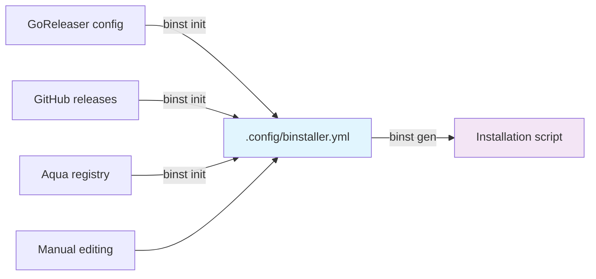

# binstaller

<p align="center">
  <h3 align="center">binstaller</h3>
  <p align="center">A modern, secure binary installer generator with enhanced security features</p>
  <p align="center">
    <a href="/LICENSE.md"></a>
    <a href="https://github.com/binary-install/binstaller/releases"></a>
  </p>
</p>

---

**binstaller** (binst) is a config-based installer shell script generator that creates secure, reproducible installation scripts for static binaries distributed via GitHub releases. Works with Go binaries, Rust binaries, and any other static binaries - as long as they're released on GitHub, binstaller can generate installation scripts for them.

## 🔄 How it Works

binstaller follows a simple two-step workflow:



1. **Step 1:** `binst init` - Generate a `.config/binstaller.yml` config from various sources
2. **Step 2 (Optional):** `binst embed-checksums` - Embed checksums into the config for enhanced security
3. **Step 3:** `binst gen` - Generate the final installation script

## ✨ Key Features

### 📝 Configuration-Based Installer Generation
- Generate installer scripts from a **simple YAML config** (`.config/binstaller.yml`)
- Auto-generate configs from **GoReleaser**, **Aqua Registry**, or **GitHub Releases**
- Hand-edit configs to customize installation behavior
- **Sustainable design** - Uses an intermediate config format that can be maintained independently
  
  > **Why this matters:** [GoDownloader](https://github.com/goreleaser/godownloader) directly generated scripts from GoReleaser configs. As GoReleaser evolved and added new features, maintaining compatibility became increasingly difficult, ultimately leading to the project being archived. By using an intermediate config format, binstaller can adapt to changes in source formats without breaking existing functionality.

### 🔁 Security Through Reproducible Generation
- Same config always generates the **exact same installer script**
- No random elements or timestamps - fully deterministic output
- Enables **cryptographic signing and verification** (e.g., GitHub Attestation, Cosign)
- Tamper-resistant with cryptographic verification - any modification to installer script is detectable

### 🛡️ Chain of Trust with Embedded Checksums
- Embed binary checksums directly into installer scripts
- When you trust the installer script, you automatically trust the binary
- No need for separate checksum files that could be tampered with
- Complete verification chain: **attestation → installer → binary**

## 📦 Installation

🎉 **You can install binstaller using a binstaller-generated script!**

### Release Installer

Official installers generated by [actionutils/trusted-go-releaser](https://github.com/actionutils/trusted-go-releaser) release workflow, which uses binstaller itself to create these secure installers. These installers provide a chain of trust:

- Generated with `binst gen --target-version` for specific release versions only
- Contains embedded checksums that were cryptographically verified during installer generation
- The trusted-go-releaser workflow creates attestations for both the installer script and the binary
- **Key benefit**: When you verify the installer script's attestation, you're also verifying:
  - The embedded checksums are authentic (came from the trusted release process)
  - The binary that will be installed matches these verified checksums
  - No additional verification needed after installation

#### Install (Latest)

```bash
# With GitHub Attestation verification (recommended)
curl -sL https://github.com/binary-install/binstaller/releases/latest/download/install.sh | \
    (tmpfile=$(mktemp); cat > "$tmpfile"; \
     gh attestation verify --repo=binary-install/binstaller --signer-workflow='actionutils/trusted-go-releaser/.github/workflows/trusted-release-workflow.yml' "$tmpfile" && \
     sh "$tmpfile"; rm -f "$tmpfile")
```

#### Install (Specific Version)

```bash
# Set the desired version
VERSION="v0.1.0"

# Install with attestation verification
curl -sL "https://github.com/binary-install/binstaller/releases/download/${VERSION}/install.sh" | \
    (tmpfile=$(mktemp); cat > "$tmpfile"; \
     gh attestation verify --repo=binary-install/binstaller --signer-workflow='actionutils/trusted-go-releaser/.github/workflows/trusted-release-workflow.yml' "$tmpfile" && \
     sh "$tmpfile"; rm -f "$tmpfile")
```

#### Install (Custom Directory)

```bash
# Set installation directory (defaults to ${BINSTALLER_BIN:-${HOME}/.local/bin})
INSTALL_DIR="/usr/local/bin"  # or any custom directory

# With GitHub Attestation verification
curl -sL https://github.com/binary-install/binstaller/releases/latest/download/install.sh | \
    (tmpfile=$(mktemp); cat > "$tmpfile"; \
     gh attestation verify --repo=binary-install/binstaller --signer-workflow='actionutils/trusted-go-releaser/.github/workflows/trusted-release-workflow.yml' "$tmpfile" && \
     sh "$tmpfile" -b "$INSTALL_DIR"; rm -f "$tmpfile")
```

**Note**: By default, binaries are installed to:
- `$BINSTALLER_BIN` if set, otherwise
- `$HOME/.local/bin` (following XDG Base Directory Specification)

### Generic Installer

```bash
# Optional: Set version (latest if empty)
VERSION="" # e.g., "v0.1.0" or leave empty for latest

# Install from main branch with attestation verification
curl -sL https://raw.githubusercontent.com/binary-install/binstaller/main/install.sh | \
    (tmpfile=$(mktemp); cat > "$tmpfile"; \
     gh attestation verify --repo=binary-install/binstaller --cert-identity-regex='.github/workflows/generate-installer.yml@refs/heads/main' "$tmpfile" && \
     sh "$tmpfile" $VERSION; rm -f "$tmpfile")
```

### GitHub Actions

```yaml
- uses: actionutils/trusted-tag-verifier@v0
  with:
    verify: 'binary-install/setup-x@v1'

- name: Install binstaller
  uses: binary-install/setup-x@v1
  with:
    script_url: https://github.com/binary-install/binstaller/releases/latest/download/install.sh
    gh_attestations_verify_flags: --repo=binary-install/binstaller --signer-workflow=actionutils/trusted-go-releaser/.github/workflows/trusted-release-workflow.yml
```

### Go Install

```bash
# Latest version
go install github.com/binary-install/binstaller/cmd/binst@latest

# Specific version
go install github.com/binary-install/binstaller/cmd/binst@v0.1.0
```

## 🚀 Quick Start

### Basic Usage

The workflow in action:

```bash
# Step 1: Initialize configuration from a source
binst init --source=github --repo=owner/repo -o .config/binstaller.yml

# Step 2 (Optional): Embed checksums for enhanced security
binst embed-checksums --config .config/binstaller.yml --version v1.0.0 --mode download

# Step 3: Generate installation script
binst gen -o install.sh
```

## 📖 Usage Examples

### From GoReleaser Configuration

```bash
# Step 1: Extract config from GoReleaser YAML
binst init --source=goreleaser --file=.goreleaser.yml -o .config/binstaller.yml

# Step 2 (Optional): Embed checksums for enhanced security
binst embed-checksums --config .config/binstaller.yml --version v1.0.0 --mode download

# Step 3: Generate installer script
binst gen --config=.config/binstaller.yml -o install.sh
```

### From GitHub Repository

```bash
# Step 1: Auto-detect from GitHub releases API
binst init --source=github --repo=junegunn/fzf -o fzf.binstaller.yml

# Step 2 (Optional): Embed checksums for enhanced security
binst embed-checksums --config fzf.binstaller.yml --version 0.44.1 --mode download

# Step 3: Generate installer
binst gen --config=fzf.binstaller.yml -o fzf-install.sh
```

### From Aqua Registry

Use configurations from [Aqua](https://aquaproj.github.io/)'s [standard registry](https://github.com/aquaproj/aqua-registry) to initialize binstaller config:

```bash
# Step 1: Initialize from Aqua's standard registry configuration
binst init --source=aqua --repo=junegunn/fzf -o fzf.binstaller.yml

# Step 2 (Optional): Embed checksums for enhanced security
binst embed-checksums --config fzf.binstaller.yml --version 0.44.1 --mode download

# Step 3: Generate installer
binst gen --config=fzf.binstaller.yml -o fzf-install.sh
```

### Manual Configuration

```bash
# Step 1: Create or edit .config/binstaller.yml manually
vim .config/binstaller.yml

# Step 2 (Optional): Embed checksums for enhanced security
binst embed-checksums --config .config/binstaller.yml --version v1.0.0 --mode download

# Step 3: Generate installer script
binst gen -o install.sh
```

## ⚙️ Configuration Format

The `.config/binstaller.yml` configuration file uses a simple, declarative format:

```yaml
# yaml-language-server: $schema=https://raw.githubusercontent.com/binary-install/binstaller/main/schema/output/@typespec/json-schema/InstallSpec.json
schema: v1
name: fzf
repo: junegunn/fzf
default_version: latest
asset:
  template: ${NAME}-${VERSION}-${OS}_${ARCH}${EXT}
  default_extension: .tar.gz
  rules:
    - when:
        os: windows
      ext: .zip
checksums:
  template: ${NAME}_${VERSION}_checksums.txt
  algorithm: sha256
supported_platforms:
  - os: linux
    arch: amd64
  - os: darwin
    arch: amd64
  - os: windows
    arch: amd64
```

### 📚 Schema Documentation

- **[TypeSpec Definition](schema/main.tsp)** - Human-readable schema definition with comprehensive documentation for all configuration options
- **[JSON Schema](schema/output/@typespec/json-schema/InstallSpec.json)** - Full JSON Schema definition for validation and IDE support
- **[Go Structs](pkg/spec/generated.go)** - Generated Go structs used by the implementation
- **[Schema Browser](https://json-schema.app/view/%23?url=https%3A%2F%2Fraw.githubusercontent.com%2Fbinary-install%2Fbinstaller%2Frefs%2Fheads%2Fmain%2Fschema%2Foutput%2F%2540typespec%2Fjson-schema%2FInstallSpec.json)** - Interactive schema explorer (external tool)

The configuration schema is defined using [TypeSpec](https://typespec.io/), which generates both the JSON Schema for validation and Go structs for the implementation. This ensures type safety and consistency across the entire toolchain.

**For detailed configuration options and their meanings, refer to the [TypeSpec definition](schema/main.tsp)**, which includes:
- Comprehensive documentation for each field
- Examples of common usage patterns
- Explanations of advanced features like platform-specific rules, architecture emulation, and embedded checksums
- Complete type information and constraints

## 📄 License

This project is licensed under the MIT License - see the [LICENSE](LICENSE) file for details.

## 🙏 Acknowledgments

* Original [GoDownloader](https://github.com/goreleaser/godownloader) project by the GoReleaser team
* [Aqua](https://aquaproj.github.io/) project for package management inspiration
* All contributors who have helped improve this project

## 🐦️ Author

| | |
|---|---|
|  | **haya14busa**<br/>[](https://github.com/haya14busa) [](https://github.com/sponsors/haya14busa) |
